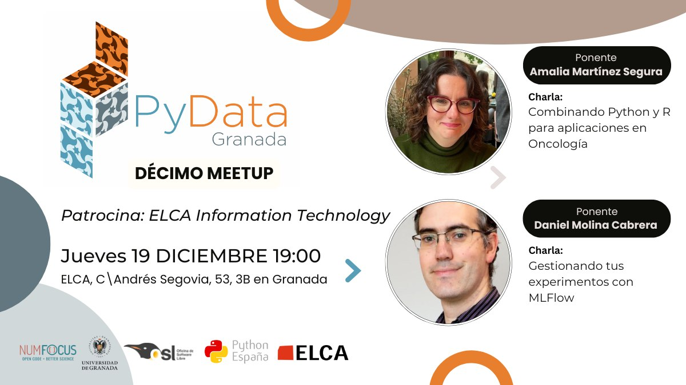

# Charla sobre MLFlow para el PyDataGR en Diciembre de 2024

Material de la charla sobre MLFlow para el PyData de Granada:

¿Has trabajo para un proyecto en distintos Notebooks, o con compañeros?  Seguro que te suena el no tener claro qué resultados son de qué modelo, o dónde está cada uno, puede ser un caos. En este caso, seguro que te gustará conocer la herramienta libre MLflow, que con unas pocas líneas permite subir los resultados de cada modelo a un almacén de resultados, para ser consultado siempre que quieras. Ya solo eso puede facilitarme mucho el trabajo,  pero ofrece mucho más. MLFlow te permite poder controlar y reproducir experimentos, gestionar y optimizar tus entrenamientos, implementar flujos de trabajo e integrarlos en plataformas de producción. Además, MLflow es flexible y fácil de usar, se integra con cualquier framework, y lenguaje, así que no te 'fuerza' a a trabajar de determinada manera para obtener  sus ventajas.

En esta charla introduciremos el MLflow desde un enfoque muy práctico, como una herramienta más a añadir a nuestro repertorio a la hora de trabajar en Machine Learning. Veremos el concepto, y tras mencionar algunas otras alternativas, mostraré cómo se puede trabajar con MLflow en distintos escenarios sencillos, para mostrar parte de su excelente funcionalidad. Ánimate, es el tipo de herramientas que cuando la descubres desearías haberla conocido antes, empieza desde ya.
